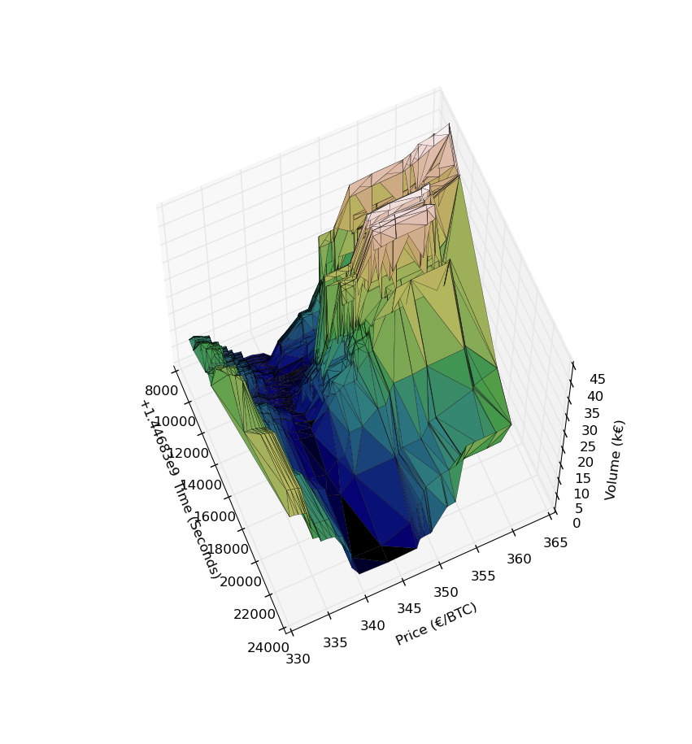

# bitcoin-de-market-depth-plot
Just a test of 3d plotting with matplotlib. Takes data from [bitcoin.de](https://www.bitcoin.de/de/market) and updates a graph showing buy/sell market depth through time.

